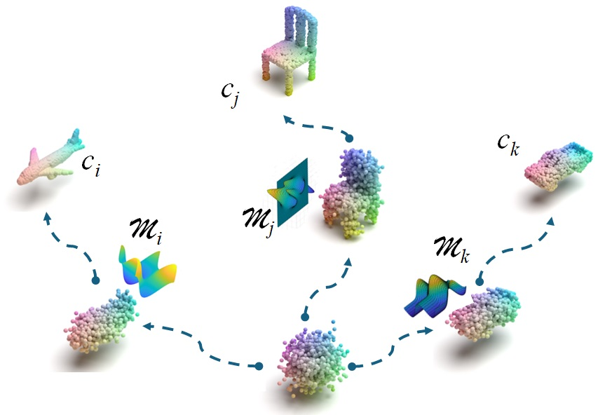
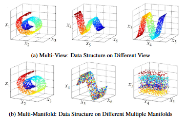

# 3D Point Cloud Generation With ManiDiff

Implementation of Shape Generation and Completion Through The ”Many Manifold” Hypothesis for 3D Shapes.

## Requirements:
Make sure the following environments are installed.
    
    python==3.9
    pytorch==1.10.2
    torchvision==0.11.3
    cudatoolkit==11.8.0
    matplotlib==2.2.3
    tqdm==4.66.1
    open3d==0.17.0
    scipy==1.10.1

## Training

### train diffusion 
We take the encoder and decoder trained on the data as usual (without conditioning input), and when training the diffusion prior, we feed the point cloud shape embedding as conditioning input.

### Data:
ShapeNet can be downloaded [here](https://shapenet.org/).
Put the downloaded data as `./data/ShapeNetCore.v2.PC15k` or edit the pointflow entry in `./datasets/data_path.py` for the ShapeNet dataset path.

### Pretrained models:
Pretrained models can be downloaded [here](https://github.com/Sun1224xy/ManiDiff/blob/master/denoising_model.pth).

### Demo:
run python `demo.py`, will load the model generate a car point cloud. 

### Evaluation:
put test data as `./datasets/test_data/`
run python `./score.py` 

## Results:
Some rendered generation and completion results are as follows.

